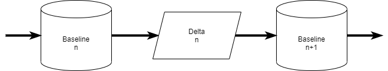

# yadd

  _Yet another DB deployer_

An exercise on validating DB deployment, inspired by Git design.

Supports Microsoft SQL Server, PostgreSQL and MySQL.

> Do not use on production environments: this is alpha software written to validate the idea and collect feedback.

## Design

To overcome the limits of the [state-based]() and [migration-based]() approach, we propose a combination of both.



At the beginning of a project, take a snapshot of DB state, typically empty: this is the initial _Baseline_.
Then apply a few change scripts to the DB, a _Delta_, and take another _Baseline_.

Yadd will check a target database before applying each Delta. Pre- and post- conditions requires to match the Baseline, in full or partially.

### Dependencies

The simplest and safest approach is to define a dependency between a delta and a whole baseline.

A more sophisticated approach would be to have a dependency on the objects directly or indirectly referenced in the delta scripts.
Many tools put this on the developer to add Guards in the scripts to check for existence of objects. This is fragile as we this example immediately clarify why is hard to implement properly and should be done by a tool.

```SQL
-- MS SQL Server
IF (EXISTS (SELECT 1 FROM sys.views WHERE name = 'EmployeeHireDate'))
    DROP VIEW EmployeeHireDate
GO

CREATE VIEW EmployeeHireDate
AS
SELECT p.FirstName, p.LastName, e.HireDate
FROM Employee AS e
JOIN Person AS  p
    ON e.BusinessEntityID = p.BusinessEntityID
```

```SQL
-- PostgreSQL
CREATE OR REPLACE VIEW EmployeeHireDate
AS
SELECT p.FirstName, p.LastName, e.HireDate
FROM Employee AS e
JOIN Person AS  p
    ON e.BusinessEntityID = p.BusinessEntityID
```

You see the problem? The script assumes existence of dependent tables and of their structure.
To check within the script one has to add quite a few statements

```SQL
-- MS SQL Server
IF (SELECT COUNT(*) FROM sys.tables WHERE name IN ('Employee','Person')) = 2
BEGIN
    -- shows differences
    (SELECT t.name, c.name FROM sys.columns AS c JOIN sys.tables AS t ON t.object_id = c.object_id WHERE t.name IN ('Employee','Person')
    EXCEPT
    (SELECT 'Employee' AS name,'id' AS name
    UNION
    SELECT 'Employee' AS name,'HireDate' AS name
    ))
    UNION
    ((SELECT 'Employee' AS name,'id' AS name
    UNION
    SELECT 'Employee' AS name,'HireDate' AS name)
    EXCEPT
    SELECT t.name, c.name FROM sys.columns AS c JOIN sys.tables AS t ON t.object_id = c.object_id WHERE t.name IN ('Employee','Person')
    )
    -- etc etc etc
    -- ..
END
```

A good solution would be to implement a parser for SQL code and extract identifiers and filter the baseline on those.

## Sample usage

Define the connection using environment variables.
Create a new repository with the `init` command.
The `history` command display the sequence of baselines in the repo.
Now it is time to `add` some scripts to a delta increment and `commit` them. The latter command applies the scripts to the connected database.

Finally the `upgrade` command applies the sequence of deltas in a repository to the connected database.

```Powershell
$env:YADD_PROVIDERNAME = "postegresql"
$env:YADD_CONNECTIONSTRING = "Host=localhost;Username=giuli;Database=mydb"

yadd info
 
yadd init
yadd history
yadd add ./sample-scripts/Create.sql
yadd add ./sample-scripts/Alter.sql
yadd show-stage
yadd commit "phase 1"
yadd history
yadd add ./sample-scripts/Alter-Next.sql
yadd show-stage
yadd commit "phase 2"
yadd history
```

You can explore the content of the `.yadd` directory: it is the repository of database states and changes.

Now that you defined how to progress from an initial stage to new schema, try to apply the changes to a different database using the same repository.

```Powershell
$env:YADD_CONNECTIONSTRING = "Host=someotherhost;Username=giuli;Database=myshareddb"

yadd upgrade
```

If the target database does not match the initial schema the command will stop and no changes are applied.


The repository is provider specific: you cannot reply a SQL Server history on a MySQL database and vice-versa.

You can see this by comparing the two content of the two yadd directories.

```Powershell

mv .yadd .yadd_psql

$env:YADD_PROVIDERNAME = "mssql"
$env:YADD_CONNECTIONSTRING = "Data Source=(localdb)\ProjectsV13;Initial Catalog=yadd-test;Integrated Security=True;Connect Timeout=30;Encrypt=False;TrustServerCertificate=False;ApplicationIntent=ReadWrite;MultiSubnetFailover=False"

yadd info
 
yadd init
yadd history
yadd add ./sample-scripts/Create.sql
yadd add ./sample-scripts/Alter.sql
yadd show-stage
yadd commit "phase 1"
yadd history
yadd add './sample-scripts/Alter-Next(MSSQL).sql'
yadd show-stage
yadd commit "phase 2"
yadd history
```

The SHA hashes looks different because the tool collects different, provider specific, information.

## Schema information

The schema data collected is not hardcoded, it is listed in the `providers.toml` file.
You can edit the content and compare the different results.